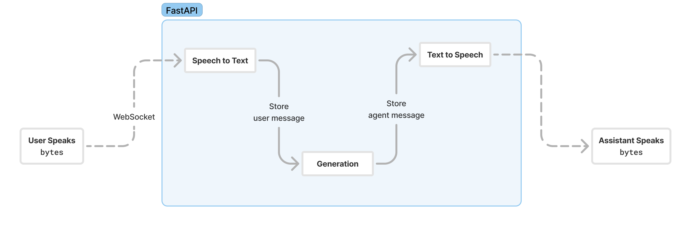

<h1 align="center">Voice2Voice App</h1>
<div align="center">
    <a align="center" href="https://www.python.org/downloads/release/python-3128/"></a>
    <a href="https://fastapi.tiangolo.com/"></a>
    <a href="https://docs.pydantic.dev/latest/"></a>
    <a href="https://github.com/astral-sh/uv"></a>
    <a href="http://mypy-lang.org/"></a>
    <a href="https://github.com/astral-sh/ruff"></a>
</div>

## Description
This repository contains the backend for a voice-to-voice application. The application uses a WebSocket to communicate with the frontend. The backend is built using FastAPI and PydanticAI.

- Speech-to-Text: The application uses the Groq API to convert speech to text (`whisper-large-v3-turbo`).
- Text generation: The application uses the Groq API through a PydanticAI Agent to generate chat completions (`llama-3.3-70b-versatile`). The agent currently has one tool that fetches the weather for a given location. It serves as an example and can be expanded with more tools.
- Text-to-Speech: The application uses the OpenAI API to convert text to speech (`tts-1`).

**Note**: Even though the application uses the mentioned models/APIs, you can easily use your preferred ones.

Finally, the application uses a PostgreSQL database to store the chat history.

**Note**: The application uses a very basic UI to test the backend. The UI is a simple HTML file that uses JavaScript to communicate with the backend. Is not intended to be used in production.



## Stack
* Programming Language: [Python 3.12.8](https://www.python.org/)
* LLM Framework: [PydanticAI](https://ai.pydantic.dev/) & [OpenAI](https://platform.openai.com/docs/api-reference/introduction)
* Framework: [FastAPI 0.115.6](https://fastapi.tiangolo.com/)
* Dependency & Package Manager: [uv](https://docs.astral.sh/uv/)
* Linters: [Ruff](https://docs.astral.sh/ruff/)
* Type Checking: [MyPy](https://mypy-lang.org/)
* Deployment: [Docker](https://www.docker.com/)

## Configure
Copy the stub `.env copy` file to `.env` and replace placeholder values with the required credentials:
```shell
cp .env\ copy .env
```
```
DB_NAME=fillme
DB_USER=fillme
DB_PASSWORD=fillme
DB_HOST=fillme
DB_PORT=fillme


GROQ_API_KEY=fillme
OPENAI_API_KEY=fillme
WEATHERSTACK_API_KEY=fillme
```

## Installation

There are two ways to run the application: using Docker or running it locally in the shell.

### Using `Docker`

1. **Clone the Git repository to your local machine:**

   ```shell
   git clone https://github.com/jjovalle99/Voice2Voice.git
   ```

2. **Ensure Docker is installed on your machine.** For more information, visit the official [Docker documentation](https://docs.docker.com/).

3. **Build the Docker image:**

   ```shell
   make docker_build
   ```

4. **Run the Docker container:**

   ```shell
    make docker_run
    ```
    **Note:** This will work only if you have the required credentials in the `.env` file.
    **Note:** If you are using a local PostgreSQL database (`localhost`) you need to change the `DB_HOST` value in the `.env` file to `host.docker.internal`.
    **Note:** You can inspect the running container by running `make docker_logs`.

5. **Access the application and database.** Visit the default app path at [http://localhost:8000](http://localhost:8000). If everything is working correctly, you'll see the UI.

6. **Stop the Docker container:**

   ```shell
   make docker_stop
   ```

### Running Locally in the Shell

1. **Clone the Git repository to your local machine:**

   ```shell
   git clone https://github.com/jjovalle99/Voice2Voice.git
   ```

2. **Install `uv` by following the instructions** [here](https://docs.astral.sh/uv/getting-started/installation/).

3. **Install the dependencies and package:**

   ```shell
   uv sync --all-groups
   ```

4. **Start the API:**

   ```shell
   make dev
   ```
    **Note:** This will work only if you have the required credentials in the `.env` file.

5. **Access the application and database.** Visit the default app path at [http://localhost:8000](http://localhost:8000). If everything is working correctly, you'll see the UI.

6. **Stop the application and background services.** Terminate the processes you (this may involve using `Ctrl+C` in the terminal)

## Structure
```shell
── Dockerfile
├── LICENSE
├── Makefile
├── README.md
├── pyproject.toml
├── sample_ui.html
├── server.py
├── src
│   └── app
│       ├── __init__.py
│       ├── api # Contains the dependencies for the WebSocket and the FastAPI Lifespan
│       │   ├── __init__.py
│       │   ├── dependencies.py
│       │   └── lifespan.py
│       ├── config # Contains the configuration settings and credentials for the application
│       │   ├── __init__.py
│       │   ├── database.py
│       │   ├── engine.py
│       │   └── settings.py
│       ├── database # Contains the database connection and queries
│       │   ├── __init__.py
│       │   ├── actions.py
│       │   └── connection.py
│       ├── engine # Contains the speech-to-text and text-to-speech definitions
│       │   ├── speech_to_text.py
│       │   └── text_to_speech.py
│       └── services # Contains the PydanticAI Agent logic.
│           ├── __init__.py
│           ├── agent.py
│           ├── factories.py
│           ├── tools.py
│           └── utils.py
└── uv.lock
```